# solucionario
# SPRINT 1
## Diseño y implementación inicial
### 1. Diseñar las clases responsables de manejar las condiciones climáticas (Temperatura, Lluvia, Viento)+(Humedad, PresionAtmosferica).
- Clases SIN responsabilidades<br>
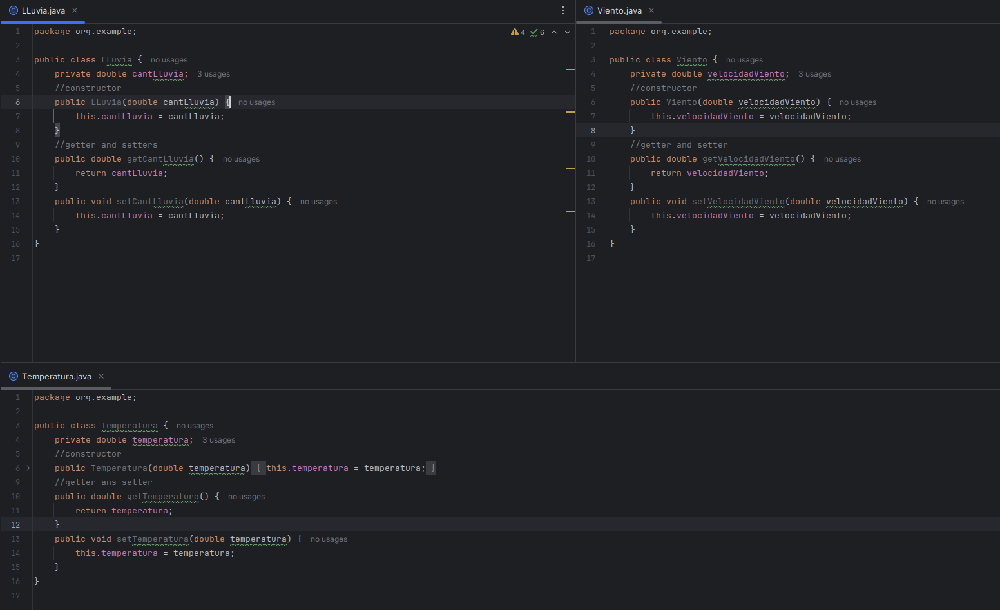
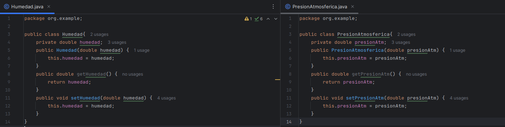
- En cada clase con un NOMBRE que lo describe se le asigna el atributo correspondiente a cada uno con su respectivo contructor y se añade los métodos getter and setter para poder manejar la clase.
- No se le añade todavía ninguna responsabilidad como se indica
### 2. Implementar estas clases asegurando que cada una tenga una única responsabilidad.
- Clases CON responsabilidad UNICA<br>
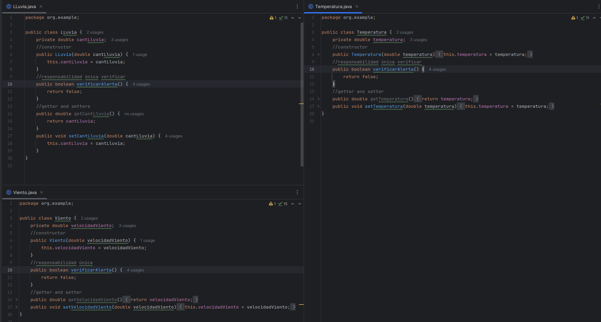
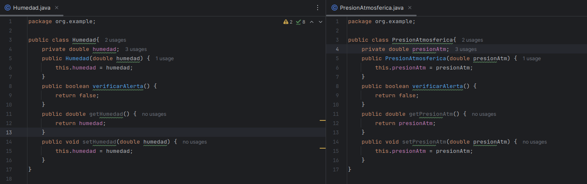
```java
    public boolean verificarAlerta() {
        return false;
    }
```
- se le añade la responsabilidad a cada clase con el método verificar alerta que indicará cuando se sobrepasa el límite permitido para condiciones consideradas "normales"
- se le deja a todos con el retorno por defecto false pues se va aplicar TDD más adelante para implementarlo
### explicación y observaciones de los resultados mostrados
- el método verificarAlerta() en todos los métodos devolverán un booleano y los límites puestos para cada condición son referenciales
- se imprime una alerta para verificar si la condición se está cumpliendo, pero cuando ya no se necesite se borrarán
- los test se implementaron antes de incluir la funcionalidad (responsabilidad única), pero para seguir el orden propuesto en el examen se indica antes
## Desarrollo con TDD:
### 1. Escribir pruebas unitarias para cada clase antes de implementar la funcionalidad.
#### LLuvia
```java
class LLuviaTest {
    LLuvia lluvia;
    @BeforeEach
    void setUp() {
        lluvia = new LLuvia(0); // Inicializamos con 0 mm de lluvia para cada test
    }
    @AfterEach
    void tearDown() {
        lluvia = null; // Limpiar
    }
    @Test
    void verificarAlertaConLluviaIntensa() {
        lluvia.setCantLluvia(25); //desencadenar una alerta
        assertTrue(lluvia.verificarAlerta(), "RESULTADO true para lluvia intensa");
    }
    @Test
    void verificarAlertaSinLluviaIntensa() {
        lluvia.setCantLluvia(15); //no desencadenar una alerta
        assertFalse(lluvia.verificarAlerta(), "RESULTADO false para lluvia no intensa");
    }
    @Test
    void verificarAlertaEnElUmbral() {
        lluvia.setCantLluvia(20); //umbral
        assertFalse(lluvia.verificarAlerta(), "RESULTADO false porque 20 no es mayor que 20");
    }
    @Test
    void verificarAlertaPorEncimaDelUmbral() {
        lluvia.setCantLluvia(20.1); //por encima del umbral
        assertTrue(lluvia.verificarAlerta(), "RESULTADO true porque 20.1 es mayor que 20");
    }
}
```
- Explicación de cada test:
    - verificarAlertaConLluviaIntensa: Este test verifica que la alerta se active cuando la cantidad de lluvia es claramente superior al umbral de alerta (25 mm).
    - verificarAlertaSinLluviaIntensa: Comprueba que no se active la alerta cuando la lluvia está por debajo del umbral de alerta (15 mm).
    - verificarAlertaEnElUmbral: Testea que no se active la alerta cuando la cantidad de lluvia es exactamente igual al umbral de 20 mm, dado que la condición es cantLluvia > 20.
    - verificarAlertaPorEncimaDelUmbral: Prueba que la alerta se active cuando la cantidad de lluvia es apenas superior al umbral (20.1 mm).

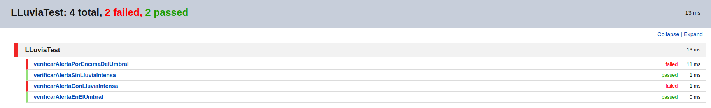
- Explicación: se verifica que dos test no pasan (porEncimaUmbral y conLLuviaIntensa), debido a que ambas deberían retornar un valor TRUE ya que no sobrepasan el umbral de 20mm, pero por defecto está puesto como false para cualquier ingreso, por lo que al no coincidir aparecen en rojo
#### Temperatura
```java
class TemperaturaTest {
    Temperatura temperatura;
    @BeforeEach
    void setUp() {
        temperatura = new Temperatura(0); // Inicializamos con 0 grados Celsius para cada test
    }
    @AfterEach
    void tearDown() {
        temperatura = null; // Limpiar
    }
    @Test
    void verificarAlertaConTemperaturaAlta() {
        temperatura.setTemperatura(25); //desencadenar una alerta
        assertTrue(temperatura.verificarAlerta(), "RESULTADO true para una temperatura alta");
    }
    @Test
    void verificarAlertaSinTemperaturaAlta() {
        temperatura.setTemperatura(15); //no desencadenar una alerta
        assertFalse(temperatura.verificarAlerta(), "RESULTADO false para una temperatura no alta");
    }
    @Test
    void verificarAlertaEnElUmbral() {
        temperatura.setTemperatura(20); // umbral
        assertFalse(temperatura.verificarAlerta(), "RESULTADO false porque 20 no es mayor que 20");
    }
    @Test
    void verificarAlertaPorEncimaDelUmbral() {
        temperatura.setTemperatura(20.1); //encima del umbral
        assertTrue(temperatura.verificarAlerta(), "RESULTADO true porque 20.1 es mayor que 20");
    }
}
```  
- Descripción de cada test:
    - verificarAlertaConTemperaturaAlta: Este test verifica que la alerta se active cuando la temperatura es claramente superior al umbral (25°C en este caso).
    - verificarAlertaSinTemperaturaAlta: Este test verifica que no se active la alerta cuando la temperatura está por debajo del umbral (15°C).
    - verificarAlertaEnElUmbral: Este test verifica que no se active la alerta cuando la temperatura es exactamente igual al umbral de 20°C, dado que la condición es temperatura > 20.
    - verificarAlertaPorEncimaDelUmbral: Este test verifica que la alerta se active cuando la temperatura es apenas superior al umbral (20.1°C).
- 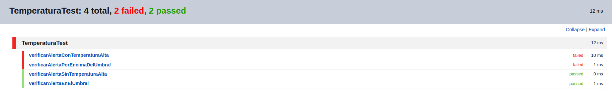
- Explicación: se verifica que dos test no pasan (conTemperaturaAlta y porEncimaUmbral), debido a que ambas deberían retornar un valor TRUE ya que no sobrepasan el umbral de 20°C, pero por defecto está puesto como false para cualquier ingreso, por lo que al no coincidir aparecen en rojo
#### Viento
```java
class VientoTest {
    Viento viento;
    @BeforeEach
    void setUp() {
        viento = new Viento(0); // Inicializamos con 0 km/h para cada test
    }
    @AfterEach
    void tearDown() {
        viento = null; // Limpiar
    }
    @Test
    void verificarAlertaConVientoFuerte() {
        viento.setVelocidadViento(55); //desencadenar una alerta
        assertTrue(viento.verificarAlerta(), "RESULTADO true para viento fuerte");
    }
    @Test
    void verificarAlertaSinVientoFuerte() {
        viento.setVelocidadViento(45); //no desencadenar una alerta
        assertFalse(viento.verificarAlerta(), "RESULTADO false para viento no fuerte");
    }
    @Test
    void verificarAlertaEnElUmbral() {
        viento.setVelocidadViento(50); //umbral
        assertFalse(viento.verificarAlerta(), "RESULTADO false porque 50 no es mayor que 50");
    }
    @Test
    void verificarAlertaPorEncimaDelUmbral() {
        viento.setVelocidadViento(50.1); //por encima del umbral
        assertTrue(viento.verificarAlerta(), "RESULTADO true porque 50.1 es mayor que 50");
    }
}
```  
- Explicación de cada test:
    - verificarAlertaConVientoFuerte: Este test asegura que la alerta se active cuando la velocidad del viento sea significativamente mayor al umbral establecido de 50 km/h.
    - verificarAlertaSinVientoFuerte: Este test verifica que no se active la alerta cuando la velocidad del viento está por debajo del umbral.
    - verificarAlertaEnElUmbral: Testea que no se active la alerta cuando la velocidad del viento es exactamente igual al umbral, ya que la condición es velocidadViento > 50.
    - verificarAlertaPorEncimaDelUmbral: Prueba que la alerta se active cuando la velocidad del viento es ligeramente superior al umbral (50.1 km/h).
- 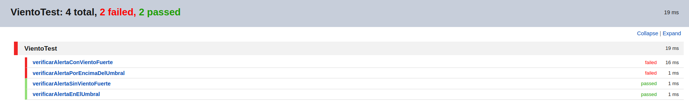
- Explicación: se verifica que dos test no pasan (porEncimaUmbral y conVientoFuertes), debido a que ambas deberían retornar un valor TRUE ya que no sobrepasan el umbral de 50km/h, pero por defecto está puesto como false para cualquier ingreso, por lo que al no coincidir aparecen en rojo
#### Humedad
```java
class HumedadTest {
    Humedad humedad;
    @BeforeEach
    void setUp() {
        humedad = new Humedad(0); // Inicializamos con 0 porcentaje
    }
    @AfterEach
    void tearDown() {
        humedad = null; // Limpiar
    }
    @Test
    void verificarAlertaConHumedadAlta() {
        humedad.setHumedad(65); //desencadenar una alerta
        assertTrue(humedad.verificarAlerta(), "Debería retornar true para humedad alta");
    }
    @Test
    void verificarAlertaSinHumedadAlta() {
        humedad.setHumedad(55); //no desencadenar una alerta
        assertFalse(humedad.verificarAlerta(), "Debería retornar false para humedad alta");
    }
    @Test
    void verificarAlertaEnElUmbral() {
        humedad.setHumedad(60); //umbral
        assertFalse(humedad.verificarAlerta(), "Debería retornar false porque 60 no es mayor que 60");
    }
    @Test
    void verificarAlertaPorEncimaDelUmbral() {
        humedad.setHumedad(60.1); //por encima del umbral
        assertTrue(humedad.verificarAlerta(), "Debería retornar true porque 60.1 es mayor que 60");
    }
}
```  
- Descripción de cada test:
    - verificarAlertaConHumedadAlta: Este test verifica que la alerta se active cuando la humedad es claramente superior al umbral (65% en este caso).
    - verificarAlertaSinHumedadAlta: Este test verifica que no se active la alerta cuando la humedad está por debajo del umbral (55%).
    - verificarAlertaEnElUmbral: Este test verifica que no se active la alerta cuando la temperatura es exactamente igual al umbral de 60%, dado que la condición es humedad > 60.
    - verificarAlertaPorEncimaDelUmbral: Este test verifica que la alerta se active cuando la humedad es apenas superior al umbral (60.1%).
- 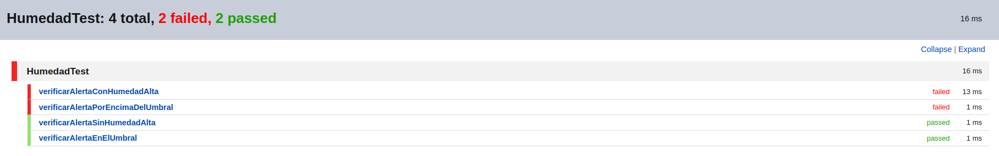
- Explicación: se verifica que dos test no pasan (porEncimaUmbral y conHumedadAlta), debido a que ambas deberían retornar un valor TRUE ya que no sobrepasan el umbral de 60%, pero por defecto está puesto como false para cualquier ingreso, por lo que al no coincidir aparecen en rojo
#### PresionAtm
```java
class PresionAtmosfericaTest {
    PresionAtmosferica presionAtmosferica;  //hPa
    @BeforeEach
    void setUp() {
        presionAtmosferica = new PresionAtmosferica(0); // Inicializamos con 0 hPa
    }
    @AfterEach
    void tearDown() {
        presionAtmosferica = null; // Limpiar
    }
    @Test
    void verificarAlertaConHumedadAlta() {
        presionAtmosferica.setPresionAtm(1025); //desencadenar una alerta
        assertTrue(presionAtmosferica.verificarAlerta(), "Debería retornar true para alta presion atmosferica");
    }
    @Test
    void verificarAlertaSinHumedadAlta() {
        presionAtmosferica.setPresionAtm(1015); //no desencadenar una alerta
        assertFalse(presionAtmosferica.verificarAlerta(), "Debería retornar false para alta presion atmosferica");
    }
    @Test
    void verificarAlertaEnElUmbral() {
        presionAtmosferica.setPresionAtm(1020); //umbral
        assertFalse(presionAtmosferica.verificarAlerta(), "Debería retornar false porque 1020 no es mayor que 1020");
    }
    @Test
    void verificarAlertaPorEncimaDelUmbral() {
        presionAtmosferica.setPresionAtm(1020.1); //por encima del umbral
        assertTrue(presionAtmosferica.verificarAlerta(), "Debería retornar true porque 1020.1 es mayor que 1020");
    }
}
```  
- Descripción de cada test:
    - verificarAlertaConHumedadAlta: Este test verifica que la alerta se active cuando la presion atmosferica es claramente superior al umbral (1020hPa en este caso).
    - verificarAlertaSinHumedadAlta: Este test verifica que no se active la alerta cuando la presion atmosferica está por debajo del umbral (1020hPa).
    - verificarAlertaEnElUmbral: Este test verifica que no se active la alerta cuando la presion atmosferica es exactamente igual al umbral de 1020hPa, dado que la condición es temperatura > 1020.
    - verificarAlertaPorEncimaDelUmbral: Este test verifica que la alerta se active cuando la presion atmosferica es apenas superior al umbral (1020hPa).
- 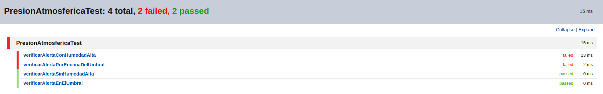
- Explicación: se verifica que dos test no pasan (porEncimaUmbral y conPresion), debido a que ambas deberían retornar un valor TRUE ya que no sobrepasan el umbral de 1020hPa, pero por defecto está puesto como false para cualquier ingreso, por lo que al no coincidir aparecen en rojo 
### Implementar la funcionalidad necesaria para que las pruebas pasen.
- se implementa la modificación en la responsabilidad de cada clase para que las pruebas pasen
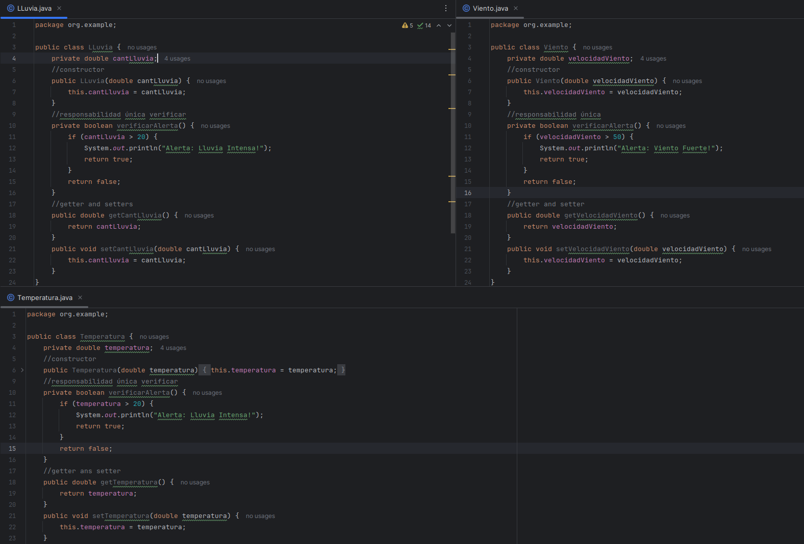
#### LLuvia
```java
        public boolean verificarAlerta() {
            if (cantLluvia > 20) {
                System.out.println("Alerta: Lluvia Intensa!");
                return true;
            }
            return false;
        }
```
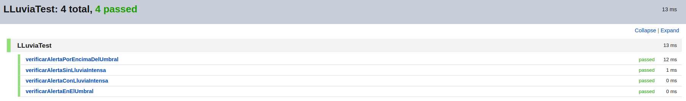
- Explicación: se le añadió una condicional con `umbral 20 para la cantidad de lluvia` en la que, si sobrepasa ese límite, se activará la alerta. Esto permite que las pruebas sean distingidas si pasan o no por el umbral
#### Temperatura
```java
    public boolean verificarAlerta() {
        if (temperatura > 20) {
            System.out.println("Alerta: Lluvia Intensa!");
            return true;
        }
        return false;
    }
```
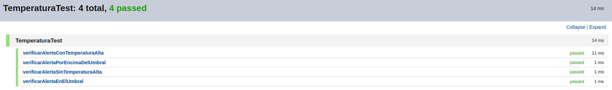
- Explicación: se le añadió una condicional con `umbral 20 para la medida de la temperatura` en la que, si sobrepasa ese límite, se activará la alerta.  Esto permite que las pruebas sean distingidas si pasan o no por el umbral
#### Viento
```java
    public boolean verificarAlerta() {
        if (velocidadViento > 50) {
            System.out.println("Alerta: Viento Fuerte!");
            return true;
        }
        return false;
    }
```
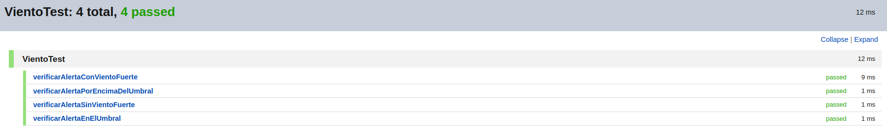
- Explicación: se le añadió una condicional con `umbral 50 para la velocidad del viento` en la que, si sobrepasa ese límite, se activará la alerta.  Esto permite que las pruebas sean distingidas si pasan o no por el umbral
#### Humedad
```java
    public boolean verificarAlerta() {
        if (humedad > 60) {
            System.out.println("Alerta: Humedad ALTA!");
            return true;
        }
        return false;
    }
```
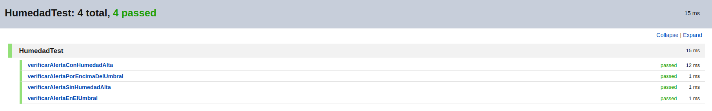
- Explicación: se le añadió una condicional con `umbral 60% de humedad` en la que, si sobrepasa ese límite, se activará la alerta.  Esto permite que las pruebas sean distingidas si pasan o no por el umbral
#### Presion Atmosferica
```java
    public boolean verificarAlerta() {
        if (presionAtm > 1020) {
            System.out.println("Alerta: Presion atmosferica ALTA!");
            return true;
        }
        return false;
    }
```
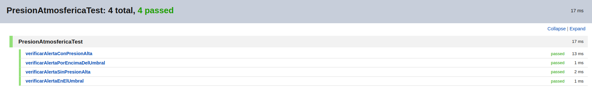
- Explicación: se le añadió una condicional con `umbral 1020hPa para la presion atmosferica` en la que, si sobrepasa ese límite, se activará la alerta.  Esto permite que las pruebas sean distingidas si pasan o no por el umbral.
### 3. Refactorizar el código después de que las pruebas pasen para mantenerlo limpio.
#### Se implementa una clase abstrac 
- EXPLICACION: Dado que las tres clases comparten una estructura y comportamiento similares, se genera una clase base abstracta que maneje la lógica común. Esto incluye el almacenamiento del valor medido (temperatura, cantidad de lluvia, velocidad del viento) y la funcionalidad de verificar una alerta, que se puede personalizar en cada subclase.
```java
public abstract class Sensor {
    protected double valor;
    public Sensor(double valor) {
        this.valor = valor;
    }
    // Método abstracto que debe ser implementado por cada sensor específico
    public abstract boolean verificarAlerta();
    public double getValor() {
        return valor;
    }
    public void setValor(double valor) {
        this.valor = valor;
    }
}
```
#### Se colocan constantes llamadas umbrales
- EXPLICACION: Cada subclase define su propio umbral de alerta como una constante, lo cual mejora la claridad y la facilidad de mantenimiento.
```java
public class LLuvia extends Sensor {
    private static final double UMBRAL_LLUVIA_INTENSA = 20;
public class Temperatura extends Sensor {
    private static final double UMBRAL_TEMPERATURA_ALTA = 20;
public class Viento extends Sensor {
    private static final double UMBRAL_VIENTO_FUERTE = 50;
public class Humedad extends Sensor{
    private static final double UMBRAL_HUMEDAD_ALTA = 60; //Celsius
public class PresionAtmosferica extends Sensor{
    private static final double UMBRAL_PRESION_ALTA = 1020; //hPa
```
#### Separación de Alertas y Verificaciones: 
- EXPLICACION:La lógica para emitir alertas se maneja en un método separado (alerta), siguiendo el principio de responsabilidad única y mejorando la cohesión del código.
```JAVA
    private void alerta(String mensaje) {
        System.out.println("Alerta: " + mensaje + "!");
    }
```
#### presentación
- Las clases quedarían de la siguiente forma
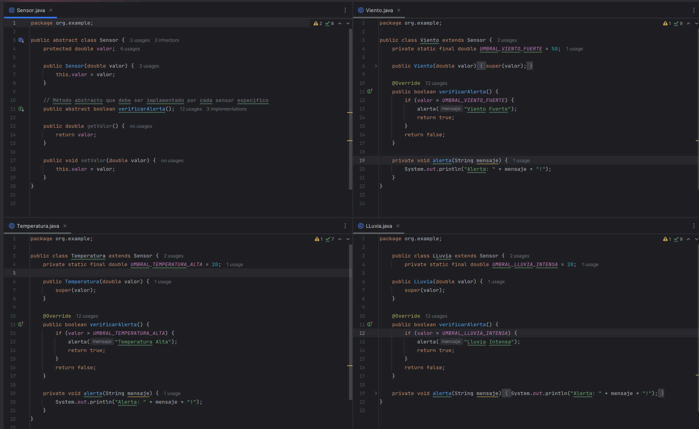
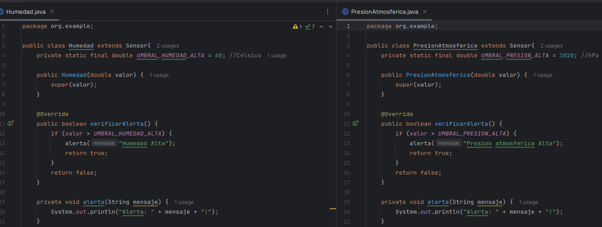
- Al incluir la clase Sensor también se cambio el nombre de los setter por uno único llamado `setValor()` por lo que se tendrá que cambiar en todos los test para que sigan pasando con normalidad
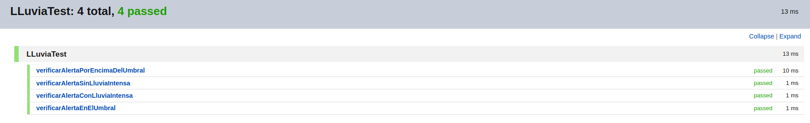

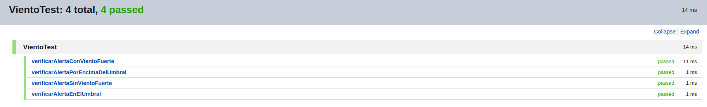


- Explicación: los cambios que se realizaron permiten que los test sigan siendo aceptados con normalidad para que pasen, de lo contrario no reconocerían las anteriores funciones que fueron renombradas con el abstrac
## Validación de pruebas con stubs y fakes:
### 1. Crear stubs para simular las condiciones climáticas
#### se crea pruebas unitarias parametrizadas para los stubs
- EXPLICACION: lo que se buscó con cada stub es que independientemente del valor ingresado, se pueda establecer un parametro booleano de salida controlado por nosotros.
- solo se muestra el código test de uno, los demás se adjuntan en la imagen
```java
import static org.junit.jupiter.api.Assertions.*;
class StubHumedadTest {
    @ParameterizedTest
    @CsvSource({
            "65, true",
            "65, false",
            "55, true",
            "55, false"
    })
    public void testVerificarAlerta(double valor, boolean alertaEsperada) {
        StubHumedad stubHumedad = new StubHumedad(valor, alertaEsperada);
        assertEquals(alertaEsperada, stubHumedad.verificarAlerta(), "La alerta debería ser " + alertaEsperada);
    }
}
```
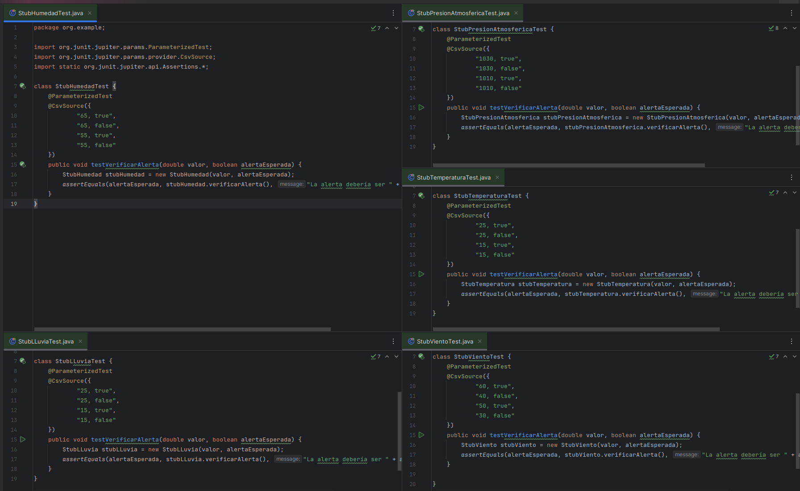
- Los test en cada caso no pasan porque siguen igual que las clases originales
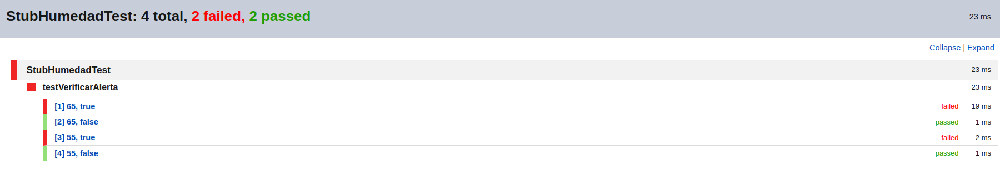

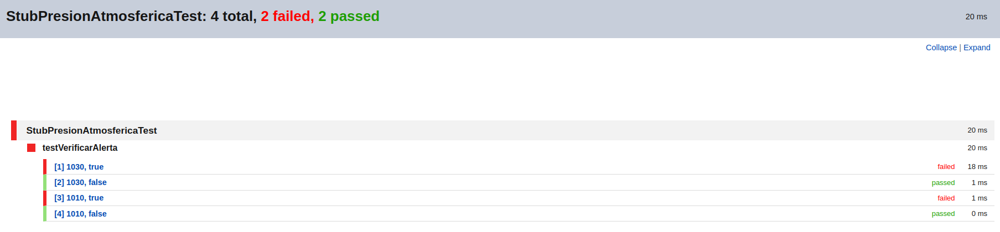
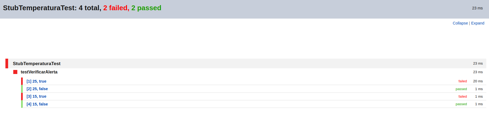

- EXPLICACION: en cada caso se verifica pero para los casos que tiene sentido (cumpla menor que el umbral) resulte falso o viseversamente. Por lo que todavía no estaría controlada la simulación.
#### se crean las clases stubs para que la preubas pasen
- EXPLICACIÓN: se crearán nuevas clases stub para cada clase que tenemos en la que al constructor se le añadirá un ingreso de la alerta que queremos simular y así controlarlo 
```java
public class StubHumedad extends Humedad {
    private boolean alerta;
    public StubHumedad(double valor, boolean alerta) {
        super(valor);
        this.alerta = alerta;
    }
    @Override
    public boolean verificarAlerta() {
        return alerta;
    }
}
```
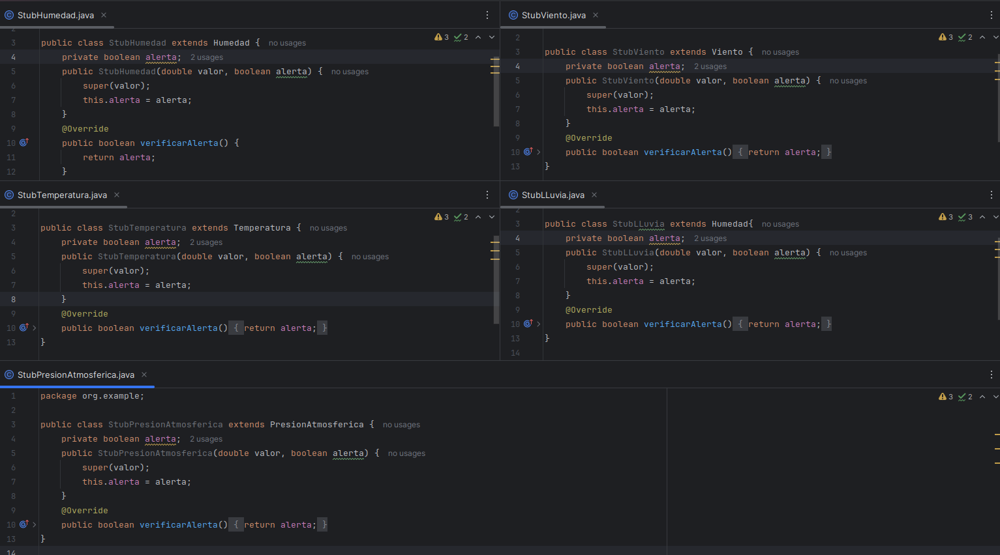
- EXPLICACIÓN: en código solo se muestra la estructura para uno, pero en la imagen se verifica que fue creado uno para cada clase que teníamos estructurado
- También se debe indicar que se utilizó `extens` pues solo vamos a usarlo para casos particulares que nosotros determinaremos, por lo que se aplica la herencia
- se usará @Override para sobreescriber el método que vamos a simular de manera preestablecida y un ingreso adicional en el constructor con el valor simulado, además de forzar el atributo que deseamos.
- Resultados
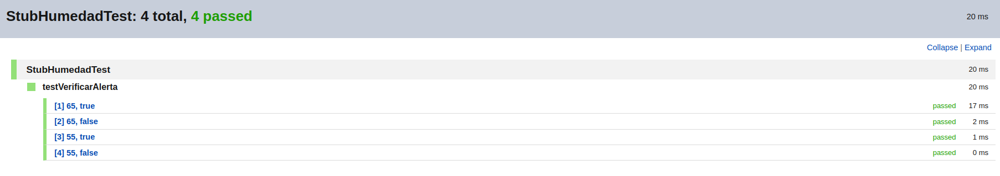
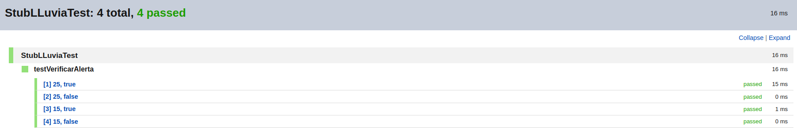
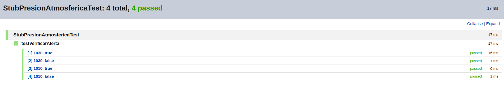

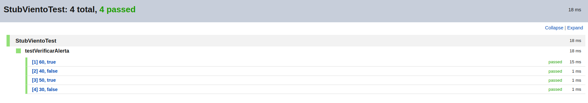
- EXPLICACIÓN: como se observa, con las modificaciones que se explicaron anteriormente se puede simular cualquier resultado sin importar si tiene sentido con el contenido del valor ingresado
#### refactoriza clases
- Explicación: se observa que en cada clase se encuentra un método repetido que lo podemos incluir en el abstrac Sensor ya usado
- Se borra el siguiente código de las clases
```java
    private void alerta(String mensaje) {
        System.out.println("Alerta: " + mensaje + "!");
    }
```
- se añade el código a la clase Sensor (abstract)
```java
public abstract class Sensor {
    protected double valor;
    private double umbral;
    private String mensajeAlerta;
    public Sensor(double valor, double umbral, String mensajeAlerta) {
        this.valor = valor;
        this.umbral = umbral;
        this.mensajeAlerta = mensajeAlerta;
    }
    public boolean verificarAlerta() {
        if (valor > umbral) {
            alerta(mensajeAlerta);
            return true;
        }
        return false;
    }
    private void alerta(String mensaje) {
        System.out.println("Alerta: " + mensaje + "!");
    }
    public double getValor() {
        return valor;
    }
    public void setValor(double valor) {
        this.valor = valor;
    }
}
```
- las clases quedarían  reestructuradas de tal manera que tengan un mejor encapsulamiento y cumplir con la nueva herencia
```java
public class Humedad extends Sensor {
    private static final double UMBRAL_HUMEDAD_ALTA = 60; // Celsius
    public Humedad(double valor) {
        super(valor, UMBRAL_HUMEDAD_ALTA, "Humedad Alta");
    }
}
public class PresionAtmosferica extends Sensor {
    private static final double UMBRAL_PRESION_ALTA = 1020; // hPa
    public PresionAtmosferica(double valor) {
        super(valor, UMBRAL_PRESION_ALTA, "Presión Atmosférica Alta");
    }
}
public class LLuvia extends Sensor {
    private static final double UMBRAL_LLUVIA_INTENSA = 20; // mm
    public LLuvia(double valor) {
        super(valor, UMBRAL_LLUVIA_INTENSA, "Lluvia Intensa");
    }
}
public class Temperatura extends Sensor {
    private static final double UMBRAL_TEMPERATURA_ALTA = 20; // Celsius
    public Temperatura(double valor) {
        super(valor, UMBRAL_TEMPERATURA_ALTA, "Temperatura Alta");
    }
}
public class Viento extends Sensor {
    private static final double UMBRAL_VIENTO_FUERTE = 50; // km/h
    public Viento(double valor) {
        super(valor, UMBRAL_VIENTO_FUERTE, "Viento Fuerte");
    }
}
```
#### refactoriza stups
- EXPLICACION: en el caso de particular de los stups verificamos que el cambio en las otras clases no ha afectado a su estrucutura gracias a un mejor encapsulamiento y uso de herencias, por lo que no es necesario ningún cambio. Como método de comprobación verificaremos que todos los test sigan pasando


### 2. Implementar fakes para simular escenarios de prueba más complejos
#### Crear la clase fake para sensores:
- ECPLICACION:
 Las clases fake permitirán establecer valores específicos y controlar el resultado de la verificación de alertas.
 ##### FAKE-HUMEDAD
```java
public class FakeHumedad extends Humedad {
    private boolean alertaForzada;
    public FakeHumedad(double valor, boolean alertaForzada) {
        super(valor);
        this.alertaForzada = alertaForzada;
    }
    @Override
    public boolean verificarAlerta() {
        return alertaForzada;
    }
    public void setAlertaForzada(boolean alertaForzada) {
        this.alertaForzada = alertaForzada;
    }
}
```
 ##### FAKE-PRESION
```java
public class FakePresionAtmosferica extends PresionAtmosferica {
    private boolean alertaForzada;
    public FakePresionAtmosferica(double valor, boolean alertaForzada) {
        super(valor);
        this.alertaForzada = alertaForzada;
    }
    @Override
    public boolean verificarAlerta() {
        return alertaForzada;
    }
    public void setAlertaForzada(boolean alertaForzada) {
        this.alertaForzada = alertaForzada;
    }
}
```
 ##### FAKE-TEMPERATURA
```java
public class FakeTemperatura extends Temperatura {
    private boolean alertaForzada;
    public FakeTemperatura(double valor, boolean alertaForzada) {
        super(valor);
        this.alertaForzada = alertaForzada;
    }
    @Override
    public boolean verificarAlerta() {
        return alertaForzada;
    }
    public void setAlertaForzada(boolean alertaForzada) {
        this.alertaForzada = alertaForzada;
    }
}
```
 ##### FAKE-LLUVIA
```java
public class FakeLLuvia extends LLuvia {
    private boolean alertaForzada;
    public FakeLLuvia(double valor, boolean alertaForzada) {
        super(valor);
        this.alertaForzada = alertaForzada;
    }
    @Override
    public boolean verificarAlerta() {
        return alertaForzada;
    }
    public void setAlertaForzada(boolean alertaForzada) {
        this.alertaForzada = alertaForzada;
    }
}
```
 ##### FAKE-VIENTO
```java
public class FakeViento extends Viento {
    private boolean alertaForzada;

    public FakeViento(double valor, boolean alertaForzada) {
        super(valor);
        this.alertaForzada = alertaForzada;
    }

    @Override
    public boolean verificarAlerta() {
        return alertaForzada;
    }

    public void setAlertaForzada(boolean alertaForzada) {
        this.alertaForzada = alertaForzada;
    }
}
```
#### Se muestra la pueba unitaria para el primer fake
```java
import org.junit.jupiter.api.BeforeEach;
import org.junit.jupiter.api.AfterEach;
import org.junit.jupiter.api.Test;
import static org.junit.jupiter.api.Assertions.*;

public class FakeHumedadTest {
    FakeHumedad fakeHumedad;
    @BeforeEach
    void setUp() {
        fakeHumedad = new FakeHumedad(0, false); // Inicializamos con 0 porcentaje y sin alerta
    }
    @AfterEach
    void tearDown() {
        fakeHumedad = null; // Limpiar
    }
    @Test
    void verificarAlertaForzada() {
        fakeHumedad.setAlertaForzada(true); // Forzamos una alerta
        assertTrue(fakeHumedad.verificarAlerta(), "Debería retornar true debido a la alerta forzada");

        fakeHumedad.setAlertaForzada(false); // Quitamos la alerta forzada
        assertFalse(fakeHumedad.verificarAlerta(), "Debería retornar false debido a la alerta forzada");
    }
}

```
##### EXPLICACION
- Como se muestra en los código se fuerzan las alertas para poder simular el escenario que se desea sin restricciones haciendo principalmente this.alertaForzada = alertaForzada, además de sus otras modificaciones en métodos sobreescritos, se realizan pruebas unitarias parametrizadas para los métodos fake

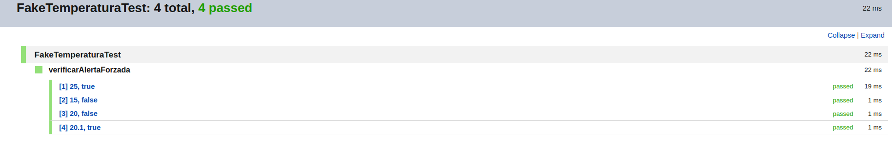

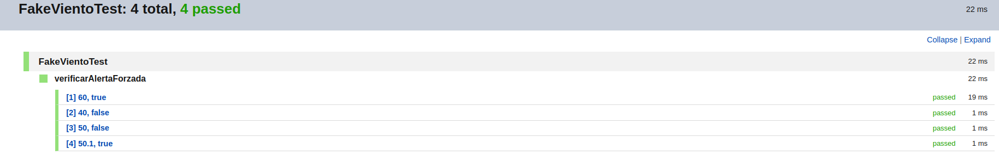
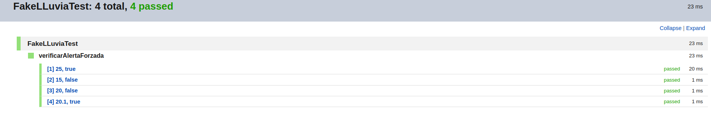
## Refactorización y código limpio:
### 1. Refactorizar el código regularmente para mejorar la legibilidad y mantenibilidad.
- EXPLICACION: En el caso particular de la refactorización, se tiene que ya no se encuentra más casos de los que tenga conocimiento para poder mejorar el código, debido a que `durante todo el proceso se ha refactorizado`, por lo que esta sección solo se mostrará el código que hasta ahora tenemos ya refactorizado
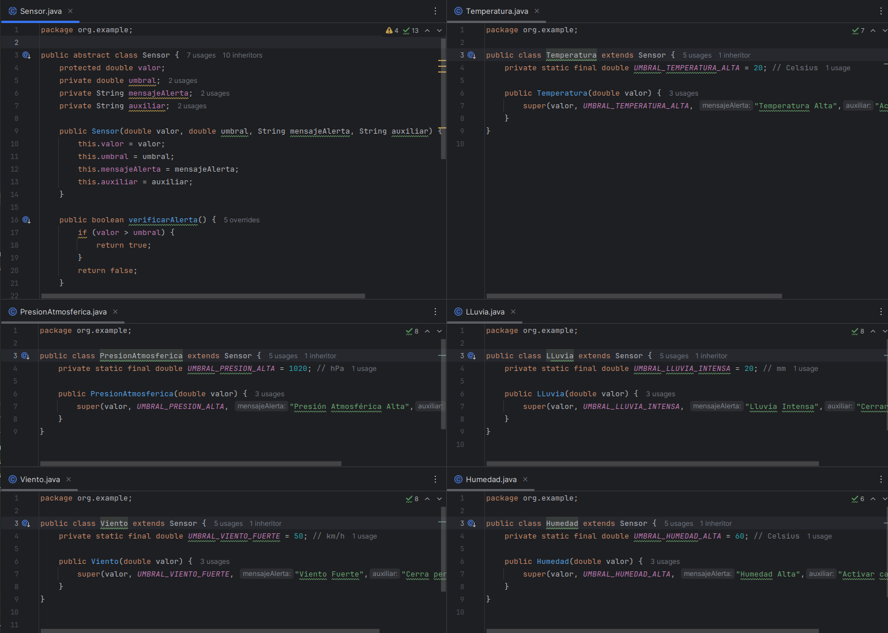
### 2. Aplicar principios de diseño limpio y patrones de diseño adecuados.
#### Primero, definimos una interfaz para el comportamiento de alerta:
```java
public interface Alerta {
    boolean verificar(double valor, double umbral);
}
```
- Explicacion: esta sepación
#### Implementamos una clase concreta de Alerta:
```java
public class AlertaPorUmbral implements Alerta {
    @Override
    public boolean verificar(double valor, double umbral) {
        return valor > umbral;
    }
}
```
#### Actualizamos la clase Sensor para utilizar la interfaz Alerta:
```java
package org.example;

public abstract class Sensor {
    protected double valor;
    private double umbral;
    private String mensajeAlerta;
    private String auxiliar;
    private Alerta alerta;

    public Sensor(double valor, double umbral, String mensajeAlerta, String auxiliar, Alerta alerta) {
        this.valor = valor;
        this.umbral = umbral;
        this.mensajeAlerta = mensajeAlerta;
        this.auxiliar = auxiliar;
        this.alerta = alerta;
    }

    public boolean verificarAlerta() {
        return alerta.verificar(valor, umbral);
    }

    public String getAuxiliar() {
        return auxiliar;
    }

    public String getMensajeAlerta() {
        return mensajeAlerta;
    }

    public double getValor() {
        return valor;
    }

    public void setValor(double valor) {
        this.valor = valor;
    }
}
```
- EXPLICACION: se añade el atributo alerta para que tenga toda la configuración necesaria para que pueda ser usado y cuente con extensionalidad 
- a los códigos y test tambien se le añadiran el argumento necesario en el constructor para que sigan manteniendo la lógica. todos las clases son parecidad, así que solo se mostrará un ejemplo de la clase y su test
```java
public class Humedad extends Sensor {
    private static final double UMBRAL_HUMEDAD_ALTA = 60; // Celsius

    public Humedad(double valor, Alerta alerta) {
        super(valor, UMBRAL_HUMEDAD_ALTA, "Humedad Alta","Activar calefacción", alerta);
    }
}
class HumedadTest {
    Humedad humedad;
    Alerta alerta;

    @BeforeEach
    void setUp() {
        alerta = new AlertaPorUmbral();
        humedad = new Humedad(0, alerta); // Inicializamos con 0 porcentaje
    }
    //demás código se mantiene igual c_
}
```
- Se comprueba que los test sigan pasando para evitar errores 


- EXPLICACION: Como todos las pruebas están en verde podemos continuar con el proyecto
## Métricas de calidad:
### 1. Utilizar herramientas para medir la cobertura de pruebas (Jacoco)
### 2. Evaluar la complejidad del código utilizando métricas como la complejidad ciclomática.

# SPRINT 2
## Contenerización del Sistema:
### Crear un Dockerfile para construir la imagen de la aplicación.
- EXPLICACION: se procederá a escribir el Dockerfile explicandole porqué se utiliza cada comando
```sh
  # Uso OpenJDK 17 instalada en mi ordenador
  FROM openjdk:17
  # Establezco el directorio de trabajo
  WORKDIR /app
  # Copio todo el contenido 
  COPY . .
  # Compilar todos los archivos Java
  RUN javac src/main/java/org/example/*.java
  # Comandos de inicio para ubicar archivo principal y ejecutarlo
  CMD ["java", "-cp", "src/main/java", "org.example.Clima"]
  ```
  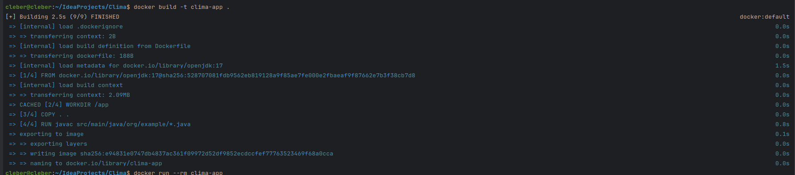
- EXPLICACION: Se busca encapsular el programa en un contenedor por lo que el comando build nos ayuda a crear una imagen y con -t nombrarlo
  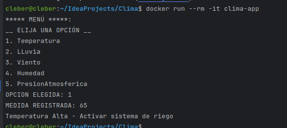
- EXPLICACION: Se busca entradas interacctivas, por lo que se tiene que incluir en el comando run --rm -it para correr, borrar cuando termine y -it que sea interactivo para que se pueda ingresar datos
### Configurar un docker-compose.yml si se necesitan múltiples servicios (bases de datos, servicios de simulación de clima).
## Refinamiento del TDD:
### Escribir nuevas pruebas para cualquier funcionalidad adicional.
### Asegurar que todas las pruebas existentes pasen en el entorno Dockerizado.
## Mejora de la estrategia de pruebas:
### Integrar las pruebas unitarias y de integración en el pipeline de Docker.
### Asegurar que los stubs y fakes funcionen correctamente en el entorno contenerizado.
## Refactorización y código limpio:
### Continuar refactorizando el código para mejorar la calidad y mantener la adherencia a los principios de diseño limpio.
## Métricas de Calidad:
### Monitorear la cobertura de pruebas y la complejidad del código en el entorno Dockerizado.
### Utilizar herramientas de análisis de código para asegurar la calidad.
